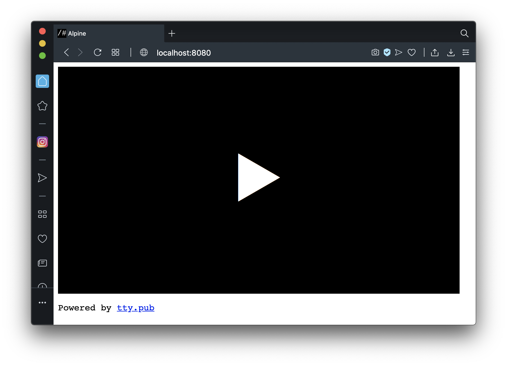
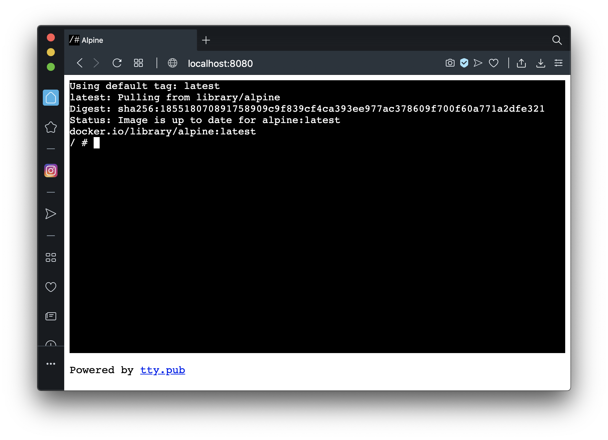

<!-- SPDX-License-Identifier: AGPL-3.0-or-later -->

# tty.pub

Serves a **[TTY]**-like interface to a newly spawned
[Docker] container to the **pub**lic.

```bash
docker run --rm -dp 8080:8080 \
    -v /var/run/docker.sock:/var/run/docker.sock \
    -e TTYPUB_FAVICON='/#' \
    -e TTYPUB_TITLE=Alpine \
    -e TTYPUB_SESSIONS=42 \
    -e TTYPUB_IMAGE=alpine \
    -e TTYPUB_CMD='["sh"]' \
    -e TTYPUB_RUNOPTS='[
        "--cpus", "0.1",
        "-m", "20M",
        "--storage-opt", "size=42M",
        "--network", "none"
    ]' \
    grandmaster/tty-pub
```






[TTY]: https://en.wikipedia.org/wiki/Tty_(unix)
[Docker]: https://www.docker.com
